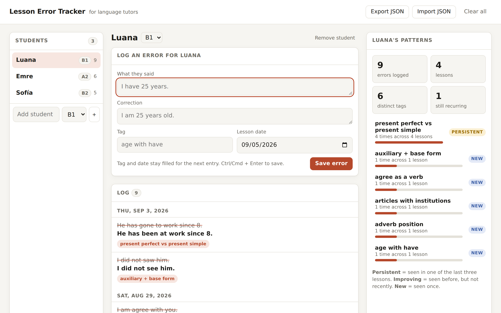

# Lesson Error Tracker

[](https://github.com/Jameel7007/error-tracker/actions/workflows/ci.yml)

**Live demo:** https://jameel7007.github.io/error-tracker/

A small, local-first app for language tutors. During a lesson you log what the student said, the correction, and a tag for the error type. Over time the app ranks each student's recurring errors and tells you which ones are persistent, which are improving, and which are new.



## Why

I teach English online, about twenty one-to-one students a week. The most useful thing I know about each student is the short list of mistakes they keep making, and I was carrying that list in my head. This is the tool I wanted: fast enough to use mid-lesson, with no account and no server, and honest about what actually recurs versus what was a one-off.

## What it does

- Students with a CEFR level, and a per-student error log grouped by lesson date
- Quick entry form that keeps the tag and date between saves, because errors in one lesson usually cluster; Ctrl/Cmd + Enter to save
- Tag autocomplete from tags you have already used
- Insights panel ranking tags by frequency, with a trend for each: **persistent** (seen in one of the last three lessons), **improving** (seen before, but not recently), **new** (seen once). Click a tag to filter the log
- Edit and delete entries inline
- **Copy summary** on each lesson: plain-text notes listing that lesson's corrections in order, plus any tag that has come up in earlier lessons, ready to paste into the student's homework message
- Export and import as JSON, with validation on import so a bad file cannot corrupt your data
- Everything is stored in `localStorage`; changes sync across open tabs
- Responsive layout, keyboard accessible, light and dark themes

## Stack

Vite, React 19, TypeScript. No UI library, no state library. Vitest with Testing Library for tests. GitHub Actions runs typecheck, tests, and build on every push and deploys `main` to GitHub Pages.

## Design notes

**Domain logic is pure and lives in `src/lib`.** Ranking, trend detection, tag normalisation, grouping, validation, and the state reducer are plain TypeScript functions with no React in them. That is where most of the tests are, and it means the UI layer stays thin.

**Trend detection is deliberately simple.** A tag is "persistent" if it appeared in any of the student's three most recent lesson dates. I tried a weighted decay first and it was harder to explain to myself than it was worth; the three-lesson window matches how I actually think about a student ("did this come up recently?").

**The lesson summary only looks backwards.** When it decides which of a lesson's tags are "still coming up", it counts lessons up to and including that date, not later ones. A summary for an old lesson should read the way it would have on the day. The first version got this wrong and a test caught it.

**Import validates against a schema by hand** rather than pulling in a validation library. The data shape is small, and a hand-written guard keeps the bundle at ~65 kB gzipped and gives clear error messages ("Error refers to unknown student").

**Tags are free text, normalised for grouping.** Forcing a fixed taxonomy up front would have made the app slower to use in a lesson. Normalising case and whitespace catches most of the drift; the autocomplete does the rest.

## Development

```bash
npm install
npm run dev        # local server
npm test           # run tests once
npm run test:watch
npm run typecheck
npm run build      # outputs to dist/
```

Deployment happens automatically from `main` via GitHub Actions. To publish Pages the first time, set the repository's Pages source to **GitHub Actions** in Settings.

## Roadmap

Things I would add if this grew past a weekend project: optional sync via a small backend so the same data is available on a tablet during lessons, and spaced-repetition prompts generated from persistent tags.

## License

MIT
